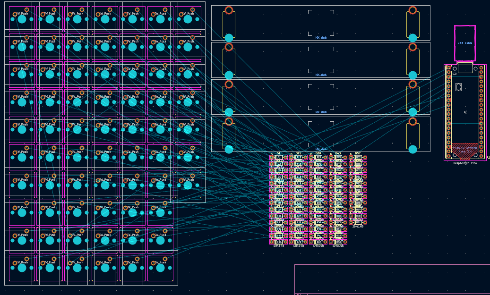
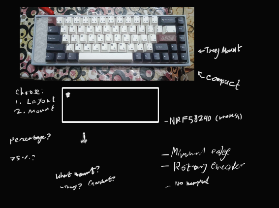
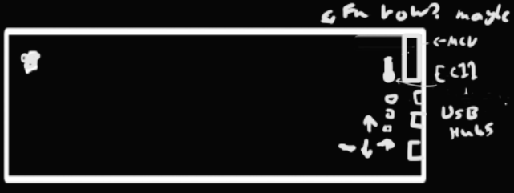
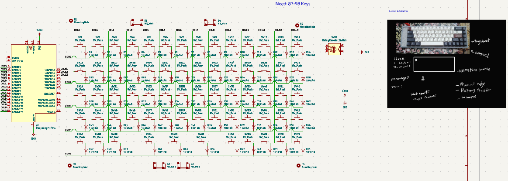

# First Journal!
|Name|Kai Board|
|Author|Henry W|
|Total Hours|~15+|

## 21-22 July 26 - ~1-1.5hr

I have begun writing this journal. Installed marbastlib. Don't have a plan for my design yet, should probably think about that soon. Put down the basics of the schematic I think I'll use. Some labels here and there. Drawing schematics is just so satisfying, yk?

The next day I worked on the columns more. Tried the first import to the pcb.

## 1 September 26 ~2.5hrs
Oh boy, it's been a while. Keeb's ending in a 30 days so I should really get cracking! I've been going back to the drawing board, since I probably really need to figure out a layout before going anywhere else at this stage. I opened a new document in Krita for hardware ideas, which is probably bad for efficiency and other methods exist, but idk. I like the compact design of [this keyboard by Tap](https://hackclub.slack.com/archives/C0ATP7MTNPJ/p1784718798722599) specifically because of the way the arrow keys are compacted with the rest of the layout. 

From my design ideas, the calculations have yielded ***87(75%)-98(96%)*** keys layedout compactly! I think that's all I need to know to start working on my PCB!

One of the things I also thought about (but didn't really need to at this stage come to think about it) was [keyboard mounting styles](https://www.monsgeek.com/blog/comprehensive-guide-to-keyboard-mounting-styles/).

- OH yeah also I wanted to add a USB hub like Geg-Tech's one.
- YES! 19.05/8mm grid is important.
- NRF52840

## 2 September 26 5hrs

Continued assigning rows/columns. Moved to reassigning things, my head hurts a LOT. The switches look nice and all layed out, but the key layout is different to what it should be. VERY MUCH SO.

I started using KBplacer somewhere this time here

## 28 September 26 4hrs
From last time I worked on this keyboard, I figured out I needed to delete an entire column, that being column 15.

This is giving me a headache. I am close though. Only like 1 key away from this layout is correct.

I think I narrowed it down to SW56 in that image
And now, this works!! Much less messy 

I proceeded to spend a long time rotating the diodes. Then rotating. Then routing.

It was here I realised that I realised I connect col_13 to the pi twice :praying:

I came across a weird issue where my keyboard edge cuts is completely busted. 

## 29 September 26 ~4hrs
I then realised it was because of a miniscule edge.cuts object.

From Kbplacer's placement that was mostly correct, there was a problem with the placement of the switches..

Now I start writing down parts for the BOM because why not. I have 67 keys and diodes. 

It is about this time I probably decide against using an LED to reduce battery usage.

I am using 301230 (301230 means 3.0 x 12 x 30 mm) Li-Po batteries, because they sit flush and fit snugly between two 4.5mm tall machine pin sockets (per [this guy](https://github.com/joric/nrfmicro/wiki/)).

Annotate schematic being a lil silly and putting components out of wack. 

I started looking for a pinout to the Supermini to help me wire the nrf to the gpio 

This, is where I come across a design dilemma. The Supermini has the exact amount of pins I need for my keyboard matrix, but one extra pin & nothing else; I can't add the other things I wanted: not the LEDs, the rotary encoder, nor the joystick.

I could also resize the board, but I can't move onto cad from there. 
I could then work on the firmware instead, but I still don't know if I want to use ZMK as opposed to RMK because rust is coolio

---

I proceeded to spend time assigning 3d models to each of these switches and all the stabilisers. I then added the mounting holes. 
